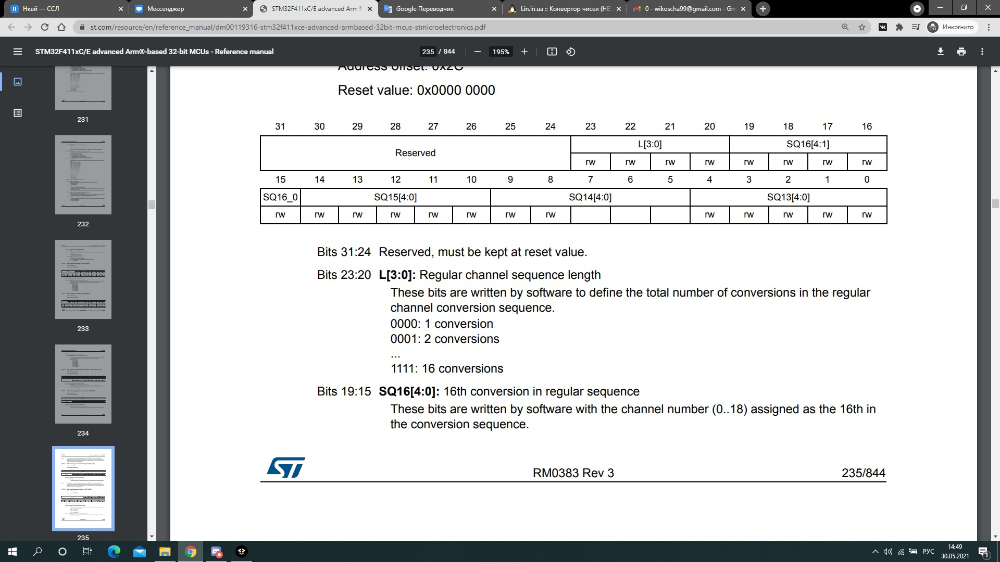

== Отчет по курсовому проекту
==== Тема:  Разработка устройства управления яркостью
==== Дисциплина: Программное обеспечение измерительных процессов

Выполнили:
----
Шевцова Виктория Андреевна КЭ-413
Нестеренко Дарья Витальевна КЭ-413
----
Проверил:
----
Колодий Сергей Владимирович
----

== Введение
=== Язык программирования C++
С++ (_далее С+_) - компилируемый строго типизированный язык
программирования общего назначения. Поддерживает разные парадигмы программирования:

* процедурную,
* обобщённую,
* функциональную.

Наибольшее внимание уделено поддержке объектно-ориентированного программирования (*ООП*).

Разработка языка началась в _1979_ году. Целью создания *C+* было
дополнение языка *C* возможностями, удобными для масштабной разработки ПО,
с сохранением гибкости, скорости и портабельности языка программирования *C*.
Вместе с тем создатели
*C+* стремились сохранить совместимость с *C*: синтаксис первого основан на
синтаксисе последнего, и большинство программ на *C* будут работать и как *C+*.
Изначально новый язык назывался “C с классами”, но затем имя было изменено на
*C+* — это должно было подчеркнуть
как его происходжение от *C*, так и его превосходство над последним.

Первый выпуск *C+* для коммерческого использования состоялся в _1985_ году,
вместе с публикацией книги *“The C+ Programming Language”*,
которая на долгое время стала его неофициальным стандартом.
В _1989_ году вышла вторая версия языка в сопровождении книги
*“The Annotated C++ Reference Manual”*.

В _1990-х_ годах язык стал одним из наиболее широко используемых
языков программирования общего назначения.
Первым официальным стандартом языка стал
_ISO/IEC 14882:1998_, более известный как
_C+98_. В 2003 году была принята его дополненная версия,
C+03, а в 2005 году был опубликован *“Library Technical Report 1”*
(сокращенно *TR1*) — документ, описывающий расширения стандартной библиотеки.
*TR1* не является стандартом, но большинство актуальных компиляторов _C+_ поддерживает его.
 Наконец, в _2011_ году был принят текущий стандарт, _C+11_.

=== Объектно-ориентированное программирование

Объектно-ориентированное программирование (*ООП*) позволяет разложить проблему на
составные части, каждая из которых становится самостоятельным _объектом_.
Каждый из объектов содержит свой собственный код и данные, которые относятся к этому _объекту_.

Любая программа, написанная посредством *ООП*, отражает в своих данных
состояние физических предметов либо абстрактных понятий – _объектов_
программирования, для работы, с которыми она предназначена.

Все данные об объекте программирования и его связях с другими
_объектами_ можно объединить в одну структурированную переменную.
В первом приближении ее можно назвать _объектом_.

С _объектом_ связывается набор действий, иначе называемых _методами_.
С точки зрения языка программирования набор действий или _методов_ –
это функции, получающие в качестве обязательного параметра указатель
на _объект_ и выполняющие определенные действия с данными _объекта_ программирования.
Технология *ООП* запрещает работать с объектом иначе, чем через _методы_, таким образом,
внутренняя структура объекта скрыта от внешнего пользователя.

Описание множества однотипных объектов называется _классом_.

*Объект* – это структурированная переменная, содержащая всю информацию
о некотором физическом предмете или реализуемом в программе понятии.

*Класс* – это описание множества объектов программирования (объектов)
и выполняемых над ними действий.

_Класс_ можно сравнить с чертежом, согласно которому создаются объекты.
Обычно _классы_ разрабатывают таким образом, чтобы их объекты соответствовали
объектам предметной области решаемой задачи.

=== Основные понятия объектно-ориентированного программирования

Любая функция в программе представляет собой _метод_ для _объекта_ некоторого класса.

_Класс_ должен формироваться в программе естественным образом, как только в ней возникает
необходимость описания новых объектов программирования. Каждый новый шаг в разработке
алгоритма должен представлять собой разработку нового класса на основе уже существующих.

Вся программа в таком виде представляет собой объект некоторого класса
с единственным методом **run** (_выполнить_).

Программирование _«от класса к классу»_ включает в себя ряд новых
понятий. Основными понятиями *ООП* являются:

* инкапсуляция;
* наследование;
* полиморфизм.

*Инкапсуляция* *данных*  – это механизм, который объединяет данные и код,
манипулирующий с этими данными, а также защищает и то, и другое
от внешнего вмешательства или неправильного использования. В *ООП* код и данные могут быть
объединены вместе (в так называемый _«черный ящик»_) при создании _объекта_.

Внутри объекта код и данные могут быть _закрытыми_ или _открытыми_.

_Закрытые_ код или данные доступны только для других частей того же самого объекта и,
соответственно, недоступны для тех частей программы, которые существуют вне объекта.

_Открытые_ код и данные, напротив, доступны для всех частей программы, в том числе
и для других частей того же самого объекта. Они представляют своего рода интерфейс
для работы с объектом из других частей программы.

*Наследование* гласит о том, что новый, или производный класс может быть
определен на основе уже имеющегося, или базового класса.

При этом новый _класс_ сохраняет все свойства старого: данные _объекта_ базового класса включаются
в данные объекта производного, а _методы_
базового _класса_ могут быть вызваны для _объекта_ производного _класса_,
причем они будут выполняться над данными включенного в него _объекта_ базового класса.

Иначе говоря, новый _класс_ наследует как данные старого класса, так и _методы_ их обработки.

Если объект наследует свои свойства от одного родителя, то говорят об *одиночном
наследовании*. Если объект наследует данные и методы от нескольких базовых классов,
то говорят о *множественном наследовании*.

*Полиморфизм* – это свойство, которое позволяет один и тот же идентификатор
(одно и то же имя) использовать
для решения двух и более схожих, но технически разных задач.

Целью _полиморфизма_, применительно к *ООП*, является использование
одного имени для задания действий, общих для ряда классов объектов.
Такой _полиморфизм_ основывается на возможности включения в данные объекта
также и информации о _методах_ их обработки (в виде указателей на функции).

Будучи доступным в некоторой точке программы, _объект_, даже при отсутствии
полной информации о его типе, всегда может корректно вызвать свойственные ему _методы_.

=== Операционная система реального времени

Операционные системы реального времени (*ОСРВ*, по англ. *RTOS*)  предназначены для
обеспечения интерфейса к ресурсам критических по времени систем реального времени.
Основной задачей в таких системах является своевременность (_timeliness_) выполнения
обработки данных.

*FreeRTOS* — многозадачная _операционная система реального времени_ (*ОСРВ*) для встраиваемых систем.

Важные понятия *RTOS*:

*Системный тик*

Один из таймеров микроконтроллера настраивают на генерацию системных тиков.
Один тик делается, обычно, раз в 1 мс, но можно и чаще или реже.
В зависимости от того какая реакция и дискретность системы нам нужна.

.Системный тик
image::photos/Tick.png[]

__Каждый *tick* - это вызов прерывания таймера, в котором вызывается диспетчер, чьими усилиями
проворачиваются шестеренки ОС. __

*Задача*

*Основой* любой *RTOS* является _задача_. _Задача_ выглядит как функция которая
крутит бесконечный цикл делающий относительно простую процедуру.

*Планировщик задач*

*Планировщик* заботится о том, чтобы у каждой задачи все сохранялось и запоминалось:
_текущее положение, стек, переменные, регистры_ и с точки зрения _задачи_ ничего не
происходило.

Изначально задача не инициализирована, но в нужный момент пользователь создает её командой
*xTaskCreate(……)* где в длинном перечне аргументов мы указываем на нашу задачу,
ее приоритет, имя для отладки.

Пример кода:

[source, cpp]
----
Rtos::CreateThread(myVariableTask, "Execute", ThreadPriority::normal);
----

=== Среда разработки программ для микроконтроллера

*Интегрированная среда разработки* - комплекс программных средств, используемый программистами
для разработки программного обеспечения.

*IAR Embedded Workbench* — это интегрированная отладочная среда разработки приложений (*IDE*),
обладающая рядом неоспоримых преимуществ.

--
За последние время в среде разработки *IAR Embedded* был сделан огромный скачок с точки зрения
удобства использования, так и с точки зрения поддержки современных стандартов. Так версия 8.X
получила поддержку стандарта _С+14_, а начиная с версии 8.40 и поддержку стандарт _С+17_ и это
является огромным плюсом для разработки надежного, понятного и качественно _ПО_.

В таблице 1 приведены основные характеристики *IAR Embedded Workbench*

--

.Характеристики IAR Embedded Workbench
[options="header"]
|=====================
|Характеристика|IAR Embedded Workbench
|Языки               |С/C++
|Стандарты языка     |С++ 17 начиная с версии 8.40
|Оптимизация кода    |Да, кроме condition_variable, future, mutex, shared_mutex, thread, поддержка
atomic урезана и реализована только для типов для которых есть аппаратная поддержка atomic
специальными командами в микроконтроллерах
|Контроль размера стека  |Да
|Поддержка RTOS  |Да
|Статический анализатор кода с набором правил |Да - MISRAC++2008, SECURITY,CERT, STDCHECKS
|Динамический анализ кода  |C-RUN
|Сертификация и проверка соответствию стандартам безопасности  |Сертификация на безопасность по стандартам IEC 61508 и ISO 26262 экспертной организацией TUV SUD – SIL3 сертификат
|Поддержка микроконтроллера STM32F411 RE |Полная
|=====================

== Отладочная плата
[cols="a, a"]
|===
| * *STM32F411RET6 ядро:* ARM® 32-bit Cortex™-M4 |  * *CP2102:* USB - UART преобразователь
| * *Arduino разъем:* для подключения Arduino шилдов ​| * *ICSP interface:* Arduino ICSP
| * *USB разъем:* USB коммуникационный интерфейс| * *SWD interface:* для программирования и отладки
| * *ST Morpho разъемы:*  для упрощения расширения​| * ​*6-12 V DC вход питания*
| * *Пользовательская кнопка* | *​ *Кнопка Сброса*
| * *Индикатор питания* | * *Пользовательские светодиоды*
| * *Индикаторы последовательного порта Rx/Tx* ​| *8 MHz кварцевый резонатор*
| * *32.768 KHz кварцевый резонатор* | http://www.waveshare.com/xnucleo-F411RE.htm
|===

.Отладочная плата
image::photos/plata[]

*Микроконтроллер ST32F411RE*

.Функциональные блоки микроконтроллера *STM32F411*
image::photos/microcontroller.png[]

.Ядро Cortex-M4
image::photos/cortexm4.png[]

* Ядро *Cortex* построено по __гарвардской архитектур__е с разделением шины данных и кода. ​

* Ядро *Cortex-М4* поддерживает _8/16/32-разрядные_ операции умножения, которые выполняются за 1 цикл (деление со знаком (SDIV) или без (UDIV) занимает от 2 до 12 тактов в зависимости от размера операндов​

* Ядро *Cortex-М4* поддерживает _8/16/32-разрядные_ операции умножения со сложением​

=== Характеристики ядра CortexM4

[cols="4,4,4,4"]
|===
| Параметр​ | ARM7TDMI​ | ARM Cortex-M3​| ARM Cortex-M4​
| Архитектура​ | ARMv4T (Фон Неймана)​ | ARMv7 (Гарвардская)​ | ARMv7 (Гарвардская)​
| Набор инструкций​ | Thumb/ARM​ | Thumb/Thumb-2​ | Thumb/Thumb-2, DSP, SIMD, FP​
| Конвейер​ |  3 уровня​ | 3 уровня + предсказание ветвлений​ | 3 уровня + предсказание ветвлений​
| Прерывания​ | FIQ/IRQ​ | NMI (немаскируемые) + от 1 до 240 физических источников прерываний​ | NMI (немаскируемые) + от 1 до 240 физических источников прерываний​
| Длительность входа в обработчик прерывания​ |  24-42 цикла​ | 12 циклов​ | 12 циклов​
| Длительность переключения между обработчиками прерываний​ | 24 цикла​ | 6 циклов​ | 6 циклов​
| Режимы пониженного энергопотребления​ | Нет​ | Встроены​ | Встроены​
| Защита памяти​ | Нет​ | Блок защиты памяти с 8 областями​ | Блок защиты памяти с 8 областями​
| Производительность по тесту Dhrystone​ | 0,95 DMIPS/МГц |  1,25 DMIPS/МГц​ | 1,25 DMIPS/МГц​
| Энергопотребление ядра​ | 0,28 мВт/МГц​ | 0,19 мВт/МГц​ | 0,19 мВт/МГц​
| Аппаратный модуль работы с плавающей точкой ​| нет​ | нет​ | есть​
|===

==== Характеристики микроконтроллера
[.notes]
--
Микроконтроллер имеет следующие характеристики:
--
[cols="a, a"]
|===
| *	32 разрядное ядро ARM Cortex-M4 | *	Блок работы с числами с плавающей точкой FPU
| *	512 кБайт памяти программ | *	128 кБайт ОЗУ
| * Встроенный 12 битный 16 канальный АЦП | *	DMA контроллер на 16 каналов
| *	USB 2.0 | *	3x USART
| * 5 x SPI/I2S | * 3x I2C
| * SDIO интерфейс для карт SD/MMC/eMMC | * Аппаратный подсчет контрольной суммы памяти программ CRC
| *	6 - 16 разрядных и 2 - 32 разрядных Таймера | *	1 - 16 битный для управления двигателями
| *	2  сторожевых таймера | *	1 системный таймер
| *	Работа на частотах до 100Мгц |* 81 портов ввода вывода
| *	Питание от 1.7 до 3.6 Вольт | * Потребление 100 мкА/Мгц
|===

=== Дополнительные особенности микроконтроллера

*	Настраиваемые источники тактовой частоты;
*	Настраиваемые на различные функции порты;
*	Внутренний температурный сенсор;
*	Таймеры с настраиваемым модулем *ШИМ*;
*	*DMA* для работы с модулями (*SPI*, *UART*, *ADC*… );
*	12 разрядный *ADC* последовательного приближения;
*	Часы реального времени;
*	Системный таймер и спец. прерывания для облегчения и ускорения  работы *ОСРВ*.

==== Требования к разработке:
* Для разработки должна использоваться отладочная плата *XNUCLEO-F411RE*;
* Софт должен измерять напряжение с переменного резистора, установленного на плате расширения;
* Программное обеспечение должно измерять напряжение:
** Период измерения должен быть 50 ms;
** К измеренной температуре должен быть применен цифровой фильтр вида: +
stem:[tau = int  ((1-e^(-dt/(R*C)), RC > 0 sec), (1, RC<= 0 sec))] +
{nbsp} +
stem:["FilteredValue" = "OldFiltered" + ("Value" - "OldValue") * tau], +
{nbsp} +
где dt -  100 мс; +
Value – текущее нефильтрованное измеренное значение температуры; +
oldValue -  предыдущее фильтрованное значение.
** Для измерения температуры должен использоваться встроенный *АЦП*;
** Для получения кода измерения должен использоваться механизм *DMA*;
* Для управления яркостью светодиода должен использоваться модуль *PWM*;
** Светоиод находится на порту *PortC.8*;
* Общение с платой расширения должно осуществляться через *USART2*;
** формат вывода: +
"Напряжение: " X.XXX [Units]
* Архитектура должна быть представлена в виде UML диаграмм в пакете Star UML;
* Приложение должно быть написано на языке С++ с использование компилятора ARM 8.40.2;
* При разработке должна использоваться Операционная Система Реального Времени FreeRTOS и С++ обертка над ней.

== *Перечень вопросов, подлежащих разработке:*

* В ходе работы необходимо разработать архитектуру программного обеспечения в виде диаграммы UML.
* В ходе работы необходимо разработать код программного обеспечения;
** Код должен соответствовать стандарту кодирования Стэнфордского университета;
* Работа программы должна быть продемонстрирована совместно с платой XNUCLEO-F411RE.
* Содержание работы должно соответствовать ГОСТ 19.402–78 «Единая система программной документации. Описание программы».
** работа должна быть оформлена в формате Asciidoc и выложена на Github

== Анализ требований к курсовой работе

*1) Для изменения напряжения должна использоваться плата _Accessories Shield_ или _Analog Test Shield_.*

.Analog Test Shield

Создаем класс *Resolution* в котором перечисляются все возможные значения этого типа данных.

----
enum class Resolution
{
  Bits12,
  Bits10,
  Bits8,
  Bits6
};
----

Затем создаем клас *tSampleRate* в котором перечисляются все возможные значения этого типа данных.

----

enum class tSampleRate
{
  Cycles3,
  Cycles15,
  Cycles28,
  Cycles56,
  Cycles84,
  Cycles112,
  Cycles144,
  Cycles480
};

----

В шаблон класса DMA передаем DMA2 и называем его myDMA
[source,cpp]
----

using myDMA =  DMA<DMA2>

----

Говорим, что класс ADC будет шаблонным и называться класс Т
[source,cpp]
----

template<class T>
class ADC
----

Создаем приватные переменные
[source,cpp]
----
private:

   static inline std::array<uint32_t, 2> codes; //massiv dannyx c ADC
   static inline std::uint32_t Pcodes = reinterpret_cast<std::uint32_t>(&codes); //приведениe между типами, несовместимыми друг с другом.
----

Публичные методы:
[source,cpp]
----
static void Start()
  {
   T::CR2::SWSTART::On::Set(); // начало преобразований
  }
----

[source,cpp]
----
static void On()
  {
    T::CR2::ADON::Enable::Set(); // включаем ADC
  }
----

* в регистре CR2 устанавливаем SWSTART = 1, чтобы начать преобразование, при этом ADON =1, иначе преобразование не запуститься

.Регистр CR2

[source,cpp]
----
static void dmaConfig()
  {
    T::CR2::DMA::Enable::Set(); // включаем DMA
    myDMA::ChannelSet(); // установка канала
    myDMA::DataSizeSet(); // размер данных
    myDMA::DirectionSet(); // установка направления
    myDMA::TargetSet(T::DR::Address, Pcodes); // установление пути из ADC в Pcodes
    myDMA::StreamOn(); // включаем поток
  }
----

* в регистре CR2 устанавливаем DMA=1 Для его включения

.Регистр CR2

Затем настраиваем ADС
[source,cpp]
----
static void adcConfig(Resolution resolution, tSampleRate vsamplerate) //передаем в adcConfig разрешение АЦП и частоту дискритизации
  {

    switch(resolution) // Выбор разрешений АЦП
    {
      case Resolution::Bits12:
      T::CR1::RES::Bits12::Set();
      break;

      case Resolution::Bits10:
      T::CR1::RES::Bits10::Set();
      break;

      case Resolution::Bits8:
      T::CR1::RES::Bits8::Set();
      break;

      case Resolution::Bits6:
      T::CR1::RES::Bits6::Set();
      break;

      default:
      T::CR1::RES::Bits12::Set();
      break;
    }

     //в регистре CR1 значение SCAN=1 для включения сканирования
     // в регистре CR1 значение RES=0х0, так как в DMA для него мы задаем 12 разрядов

    switch(vsamplerate)
    {
      case tSampleRate::Cycles3:
      T::SMPR2::SMP0::Cycles3::Set();
      break;

      <...>

      case tSampleRate::Cycles480:
      T::SMPR2::SMP0::Cycles480::Set();
      break;

      default:
      T::SMPR2::SMP0::Cycles480::Set();
      break;
    }

     // в регистре SMPR2 значение SMPO=0x6, так как в DMA мы устанавливаем для него значение Cycles480

  }
----
Настройка каналов для преобразований
[source,cpp]
----
static void SetChannels (std::uint32_t channelNum1, std::uint32_t channelNum2)
  {
    T::SQR1::L::Conversions2::Set();// количество измрений
    T::CR1::SCAN::Enable::Set();//установка режима сканирования
    T::CR2::EOCS::SequenceConversion::Set(); // EOC устанавливается после завершения всей последовательности регулярных преобразований.
    T::CR2::CONT::ContinuousConversion::Set(); // установлен режим непрерывного преобразования
    assert(channelNum1 <19); // проверяем номер канала
    assert(channelNum2 <19);
    T::SQR3::SQ1::Set(channelNum1); // Выбрать канал для первого преобразования
    T::SQR3::SQ2::Set(channelNum2);
    T::CR2::DDS::DMARequest::Set(); // DMA будут выполняться всегда, как только данные подготовлены и пока включен бит DMA
  }

  static std::array<uint32_t, 2>& GetValue() // метод типа массив, получает значения
  {
    return codes; // возвращает значения напряжения
  }
};
----

* в регистре SQR1 устанавливаем значение L=0x0000, так как у нас производится одно измерение

.Регистр SQR1

* в регистре CR2 значение E0СS = 0 (EOC устанавливается после завершения всей последовательности регулярных преобразований)

* В регистре CR2 значение CONT=1 (включен режим непрерывного преобразования)

.Регистр CR2

* в регистре _SQR3_ значение SQ1=1(первое преобразование будет произведено с выбранного нами канала( у нас 18))

* в регистре _СR2_ значение DDS=1, выполняется запрос на использование DMA и происходит до тех пор, пока данные преобразуются и DMA=1

* в DMA в регистре _SOCR_ значение CHSEL=0 (выбран канал 0)

* в DMA в регстре _SOCR_ значение DIR=0- показывает направление передачи данных от переферии к памяти

* в регистр _S0NDTR_ в значение NDT записываем количество данных для передачи

* в регистре _S0CR_ устанавливаем значение MSIZE=2U(32 бит)

* в регистре _S0CR_ значение MINC=1. Это значит, что указатель адреса памяти увеличивается после каждой передачи данных

* в регистре _S0CR_ значение PSIZE=2U(32 бит)

* в регистре _S0CR_ значение PINC=0, означает, что указатель периферийного адреса зафиксирован

* S0PAR::Set(PeriAdrr) - записываем адрес регистра перефирийных данных

* в регситре _S0CR_ значение CT=0- текущая целевая память - это память 0

* в регистре _S0CR_ значение CIRC=0, значит, что циклический режим отключен

* в регситре _S0CR_ значение EN=1, что озночает включение потока

2) *Передача значений по беспроводному интерфейсу должна осуществляться через модуль BlueTooth Bee HC-06*.

Передача полученных значений является довольно распространенной задачей при создании разного рода программ, работающих
с измерениями. Микроконтроллер *STM32f411* даёт право использовать данную возможность, так как поддерживает *USART*.

В нашем случае, использование модуля *BlueTooth Bee HC-06* будет оптимальным вариантом для передачи информации на ПК, телефон или другое устройство.

[cols="a"]
|===
|Основные характеристики модуля:

|Питание 3,3В – 6 В;
|Максимальное входное напряжение 5 В;
|Максимальный ток 45 мА;
|Скорость передачи данных 1200–1382400 бод;
|Рабочие частоты 2,40 ГГц – 2,48ГГц;
|Поддержка спецификации bluetooth версии 2.1;
|Малое потребление энергии;
|Высокий уровень защиты данных;
|Дальность связи 30 м;
|===

Для передачи информации через модуль *BlueTooth*, будет использован метод
операционной системы реального времени - *Sleep(1000ms)*.

3) *Общение с платой расширения должно осуществляться через USART2.*

*USART* (_Universal Synchronous Asynchronous Receiver Transmitter_) – это модуль последовательного
ввода-вывода, который может использоваться для работы с периферийными устройствами, такими как терминалы
или персональные компьютеры, модемы, микросхемами *ЦАП*, *АЦП*, последовательными *EEPROM* и т.д.

*USART* может работать в трех режимах:

* асинхронный, полный дуплекс;
* ведущий синхронный, полудуплекс;
* ведомый синхронный, полудуплекс.

Модуль приемо-передатчика обеспечивает полнодуплексный обмен по последовательному каналу,
при этом скорость передачи данных может варьироваться в довольно широких пределах. Длина
посылки может составлять от 5 до 9 битов. В модуле присутствует схема контроля и формирования бита четности.

Для корректной работы *USART* необходимо выполнить следующие действия:

1) Подать тактирование на шину *USART*;

2) Настроить порты *A2, A3* в альтернативный режим;

3) Указать альтернативные функции *TX, RX* для соответствующих портов;

4) Указать скорость (_4800 бод_);

5) Включить модуль *USART*;

[source, cpp]
----
  RCC::APB1ENRPack<
    RCC::APB1ENR::TIM2EN::Enable,
    RCC::APB1ENR::USART2EN::Enable
    >::Set() ;

  GPIOA::MODERPack<
    GPIOA::MODER::MODER2::Alternate, // Uart2 TX
    GPIOA::MODER::MODER3::Alternate  // Uart2 RX
    >::Set() ;

  GPIOA::AFRLPack <
    GPIOA::AFRL::AFRL2::Af7, // Uart2 TX
    GPIOA::AFRL::AFRL3::Af7  // Uart2 RX
    >::Set() ;

    USART2::BRR::Write(UartSpeed4800);
    USART2::CR1::UE::Enable::Set();
----
4) *Архитектура должна быть представлена в виде UML диаграмм в пакете Star UML.*

Архитектура программы будет реализована с помощью пакета *StarUML*. *StarUML* - программный
инструмент моделирования, который поддерживает UML(Унифицированный язык моделирования).

*StarUML*
ориентирован на UML версии 1.4 и поддерживает одиннадцать различных типов диаграмм, принятых в нотации
UML 2.0. Он активно поддерживает подход MDA (Модельно-управляемая архитектура), реализуя концепцию профилей
UML.

Среда разработки *StarUML* настраивается в соответствии с требованиями пользователя и имеет высокую степень расширяемости, особенно в области своих функциональных возможностей. Использование *StarUML*, одного из ведущих программных инструментов моделирования, гарантирует
достижение максимальной производительности и качества программных проектов.

5) *При разработке должна использоваться Операционная Система Реального Времени FreeRTOS и С++ обертка над ней*.

Применение Операционной Системы Реального Времени (ОСРВ) *FreeRTOS* обосновано необходимостью разделить
программу на три задачи (измерение температуры, вывод температуры на дисплей, передача температуры по Bluetotth), выполняющиеся с разной периодичностью.
ОСРВ *FreeRTOS* отлично подходит для поставленной задачи, так как распространяется бесплатно, портирована на большое количество микроконтроллеров, обладает мощным функционалом, имеет множество библиотек и хорошую документацию.

=  Архитектура проекта

.Архитектура проекта

Описание работы программы:

*Задачи:* Измерять напряжение переменного резистора.

*Принцип работы*:
_Класс VariableTask_ принимает значения,снятые с ADC. Полученные значения фильтруются и хранятся в _VariableTask_. _LedTask запрашивает_ значения напряжения у _VariableTask_ и передает их _PWM_, с помощью которого меняется яркость светодиода.
_BlueTooth_ запрашивает значения у _VariableTask_ и передает их по _USART_.

== *Детальное описание структуры проекта*

---

Класс *ADC*

.Класс *ADC*

Методы:

* *Start()*: запуск АЦП на преобразование;

* *On()*: включение АЦП;

* *Get()*: получает данные с текущего канала;

* *IsReady()*: возвращает состояние АЦП: готово или нет;

* *Config()*: устанавливаем необходимую по ТЗ характеристики: разрядность и время сэмплирования;

* *SetChannels(in channelNum1)*
прописывает в SQR1:L 1 бит, и прописывает первый канал в SQR3:SQ1, и второй в SQR3:SQ2.

* *MeasureAndGetValue()* - хранит две переменные с полученными с каналов сигналами.

---

Класс *DMA*

.Класс *DMA*

Методы:

* *ChanellSet* - устанавливаем канал, к которому подключен ацп.

* *ГDirectionSet* - устанавливаем направление передачи.
* *DataSizeSet* - устанавлием объем памяти для периферии и памяти.
* *TargetSet* - указываем целеву область памяти.
* *StreamON* - устанавливаем CircularMode и запускаем поток.

---
Класс *VariableTask*

.Класс *VariableTask*

_VariableTask_ - принимает отфильтрованное значение напряжения.

Методы:

* *GetFilteredVoltageValue* - обращаемся к классу Filter и получаем значение напряжения прошедшего через фильтр.

* *GetVoltageValue* - получаем значение напряжения с АЦП.
Получаем измеренные и посчитанные значения напряжения.

* *Execute()* - включает в себя бесконечный цикл, в котором опрашивается сигнал.

---
Класс *Voltage*

.Класс *Voltage*

Методы:

*Calculation* - рассчитываем значение напряжения.

*GetValue* - принимает значение напряжения.

---

Класс *IVariable*

.Класс *IVariable*

Методы:

*Calculation* - рассчитываем значение напряжения.

*GetValue* - принимает значение напряжения.

---

Класс Filter

.Класс *Filter*

Методы:

*update* - обновляем значение напряжения.

---

Класс *LedTask*

.Класс *LedTask*

Методы:

* *Execute()* - включает в себя бесконечный цикл, в котором опрашивается сигнал.

* *LedTask* - передаем ledTask значения с VaribleTask
---

Класс *Led*

.Класс *Led*
image::photos/Led.png[]

Методы:

* *CalculateDutyCycle*- рассчитываем рабочий цикл.

---

Класс *PWM*

.Класс *PWM*

Методы:

* *SetDuty*- создаем и передаем метод SetDuty

---

Класс *BlueToothTask*

.Класс *BlueToothTask*

Класс является активной задачей. Отвечает за передачу значений температуры по Bluetoth.
В шаблон принимает ссылку на объект класса *TemperatureTask*.

Атрибуты:

* *out* - хранит строку со значением температуры.
* *mes[27]* - хранит сформированную для отправки строку со значением температуры.

Методы:

*  *Execute()* - отвечает за передачу значений напряжения по *Bluetooth*.

---

Класс *USARTDriver*

.Класс *USARTDriver*

Методы:

* *SendMessage()* - отвечает за отправку сообщения по *USART*.

* *OnNextByteTransmit()* - отвечает за побайтовую передачу сообщения.

---

Класс *Itransmit*

.Класс *Itransmit*
image::photos/Itransmit.png[]

Класс является интерфейсом, предоставляющим доступ классу *Usart* к методу
*OnNextByteTransmit()* класса *USARTDriver*.

---

Класс *Usart*

.Класс *Usart*

Методы:

* *WriteByte()* записывает данные в регистр DR.

* *InterruptHandler()* - проверяет флаги: Пуст ли регистр данных и разрешено ли прерывание по
передаче. Затем вызывает метод *OnNextByteTransmit()* интерфейса *iTransmit*.

* *TransmitEnable()* и *TransmitDisable()* - включают и выключают передачу данных.

* *InterruptEnable()* и *InterruptDisable()* - разрешают и запрещают прерывания по передаче.

---

---

=== Демонстрация работы устройства

На рисунках представлены окна работы Терминала

.Работа программы
image::photos/F.png[]

.Работа программы

.Работа программы

== Вывод по работе:

В ходе работы, было создано устройство, для управления яркостью светодиода. Регулировка происходит за счет изменения напряжение и значение напряжение выводится в терминал.

